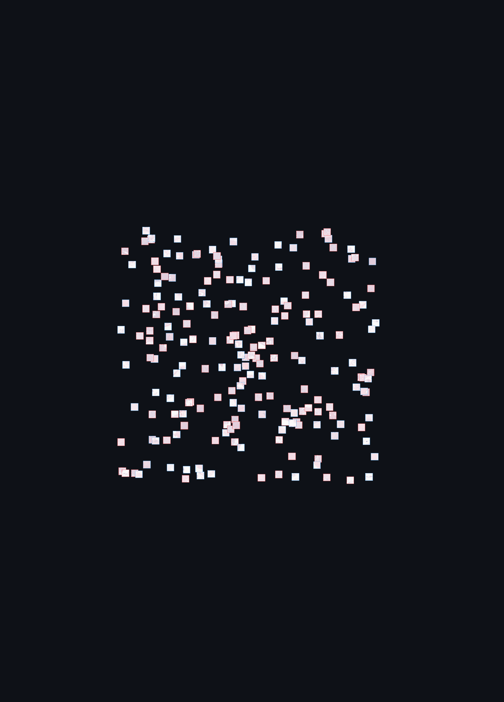
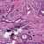
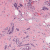
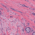
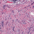
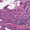
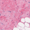

# Breast Cancer Histopathology Classification (IDC)

🇬🇧 [English](#english) · 🇫🇷 [Français](#français)

<p align="center">
  
</p>

<table align="center">
  <tr>
    <td align="center" colspan="4"><b>Malignant (IDC present)</b></td>
  </tr>
  <tr>
    <td></td>
    <td></td>
    <td></td>
    <td></td>
  </tr>
  <tr>
    <td align="center" colspan="4"><b>Benign (IDC absent)</b></td>
  </tr>
  <tr>
    <td></td>
    <td></td>
    <td></td>
    <td></td>
  </tr>
</table>

**EN** -A patient-safe deep learning pipeline that detects Invasive Ductal Carcinoma (IDC) in breast
histopathology image patches: data cleaning, a patient-level train/val/test split, model training and
evaluation, and an interactive Streamlit demo you can try with your own images.

**FR** -Un pipeline de deep learning qui détecte le Carcinome Canalaire Invasif (IDC) sur des patches
d'histopathologie mammaire : nettoyage des données, split train/val/test par patient, entraînement et
évaluation du modèle, et une démo Streamlit interactive que tu peux tester avec tes propres images.

**[Live demo](#) · [Notebooks](notebooks/) · [Pipeline source](src/idc_pipeline/)**

---

<a id="english"></a>
## English

### What this project does

- **Input**: a `50x50` RGB histopathology patch
- **Output**: `IDC absent` (benign) or `IDC present` (malignant), with a probability score

This is a **patch-level**, not patient-level, classification task: one patient can contribute both negative and positive patches.

### Try it: the Streamlit app

The [`app/`](app/) folder contains an interactive demo, organized in three tabs:

- **Predict** - upload one or several histopathology patches, get an instant prediction with a
  probability score and a confidence gauge, and adjust the decision threshold live to see the
  precision/recall trade-off
- **Model** - the model's validation/test metrics (accuracy, precision, recall, F1, ROC-AUC,
  confusion matrix), the ROC and Precision-Recall curves used to pick the threshold, and the
  checkpoint's architecture details
- **Context & Glossary** - opens with a visual showcase (an animated t-SNE map of the model's
  learned features, real patch thumbnails, benign vs. malignant), followed by the medical
  vocabulary, the preprocessing choices, class imbalance handling, metric choices, and the
  confusion-matrix trade-offs that matter for a screening tool (minimizing missed cancers vs.
  false alarms)

Run it locally:

```bash
pip install -r requirements.txt
streamlit run app/streamlit_app.py
```

### Project structure

```
├── app/                    Streamlit demo application
├── src/idc_pipeline/       Reusable pipeline package (data, model, train, evaluate, inference)
├── notebooks/               Exploration & training notebooks (see notebooks/README)
├── scripts/                 Standalone utility scripts (dataset subsampling, etc.)
├── models/demo/             Small checkpoint bundled for the Streamlit demo
├── explanation.md            Deep dive: architectures, threshold tuning, methodology
└── requirements.txt
```

### End-to-end pipeline

1. Download & extract the dataset
2. Clean and index the image patches, dropping invalid samples
3. Create a **patient-level** train/val/test split (no patient leakage across splits)
4. Visualize and sanity-check the data
5. Train a baseline CNN from scratch
6. Improve preprocessing/training (normalization, color jitter, LR scheduler)
7. Train a pretrained `ResNet18` for comparison
8. Evaluate: sweep thresholds on validation, report test metrics, compare models

See [`explanation.md`](explanation.md) for the full methodology (why patient-level splitting matters, how class imbalance is handled, how the decision threshold is chosen).

### Reproducing the demo model

The checkpoint shipped in `models/demo/` was trained locally on a small, patient-level
subsample of the full dataset (to keep training fast on a CPU). To reproduce it:

```bash
python scripts/extract_demo_subset.py --zip-path "<dataset>.zip" --output-dir data/raw/IDC_regular_ps50_idx5
python -m idc_pipeline.data --dataset-dir data/raw --output-dir artifacts
python scripts/train_demo_model.py
```

For the full, high-accuracy models (trained on the complete ~555k-patch dataset), see the notebooks
in [`notebooks/`](notebooks/) - they were run on Google Colab against the full dataset and produced
the results summarized in [`explanation.md`](explanation.md).

### Tech stack

`PyTorch` · `torchvision` · `NumPy` · `Pillow` · `Streamlit`

---

<a id="français"></a>
## Français

### Ce que fait ce projet

- **Entrée** : une image (patch) de `50x50` pixels issue d'une lame d'histopathologie
- **Sortie** : `IDC absent` (bénin) ou `IDC présent` (malin), avec un score de probabilité

Il s'agit d'une classification **au niveau du patch**, pas du patient : un même patient peut avoir des patches à la fois négatifs et positifs.

### Tester le projet : l'application Streamlit

Le dossier [`app/`](app/) contient une démo interactive, organisée en trois onglets :

- **Prédiction** - upload d'un ou plusieurs patches histopathologiques, prédiction instantanée
  avec un score de probabilité et une jauge de confiance, et ajustement du seuil de décision en
  direct pour voir le compromis précision/rappel
- **Modèle** - les métriques de validation/test (accuracy, précision, rappel, F1, ROC-AUC, matrice
  de confusion), les courbes ROC et Precision-Recall utilisées pour choisir le seuil, et le détail
  de l'architecture du checkpoint
- **Contexte & Glossaire** - s'ouvre sur une vitrine visuelle (une carte t-SNE animée des features
  apprises par le modèle, de vraies vignettes de patches, bénins vs. malins), suivie du vocabulaire
  médical, des choix de prétraitement, de la gestion du déséquilibre des classes, du choix des
  métriques, et des compromis de la matrice de confusion pertinents pour un outil de dépistage
  (minimiser les cancers manqués vs. les fausses alertes)

Pour la lancer en local :

```bash
pip install -r requirements.txt
streamlit run app/streamlit_app.py
```

### Structure du projet

```
├── app/                    Application Streamlit de démonstration
├── src/idc_pipeline/       Package réutilisable (données, modèle, entraînement, évaluation, inférence)
├── notebooks/               Notebooks d'exploration et d'entraînement
├── scripts/                 Scripts utilitaires autonomes (sous-échantillonnage, etc.)
├── models/demo/             Petit checkpoint embarqué pour la démo Streamlit
├── explanation.md            Approfondissement : architectures, choix du seuil, méthodologie
└── requirements.txt
```

### Pipeline de bout en bout

1. Téléchargement et extraction du dataset
2. Nettoyage et indexation des patches, suppression des échantillons invalides
3. Création d'un split train/val/test **au niveau patient** (aucune fuite de patient entre les splits)
4. Visualisation et vérification des données
5. Entraînement d'un CNN de base from scratch
6. Amélioration du prétraitement/entraînement (normalisation, color jitter, scheduler de LR)
7. Entraînement d'un `ResNet18` pré-entraîné à titre de comparaison
8. Évaluation : balayage des seuils sur la validation, métriques de test, comparaison des modèles

Voir [`explanation.md`](explanation.md) pour la méthodologie complète (pourquoi le split par patient est important, comment le déséquilibre de classes est géré, comment le seuil de décision est choisi).

### Reproduire le modèle de démo

Le checkpoint fourni dans `models/demo/` a été entraîné localement sur un petit sous-échantillon
du dataset complet, respectant le split par patient (pour rester rapide sur CPU). Pour le reproduire :

```bash
python scripts/extract_demo_subset.py --zip-path "<dataset>.zip" --output-dir data/raw/IDC_regular_ps50_idx5
python -m idc_pipeline.data --dataset-dir data/raw --output-dir artifacts
python scripts/train_demo_model.py
```

Pour les modèles complets à haute précision (entraînés sur les ~555k patches du dataset complet),
voir les notebooks dans [`notebooks/`](notebooks/) - exécutés sur Google Colab sur le dataset complet,
avec les résultats résumés dans [`explanation.md`](explanation.md).

### Stack technique

`PyTorch` · `torchvision` · `NumPy` · `Pillow` · `Streamlit`
